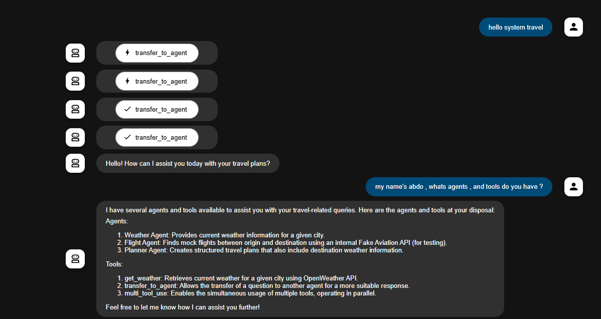
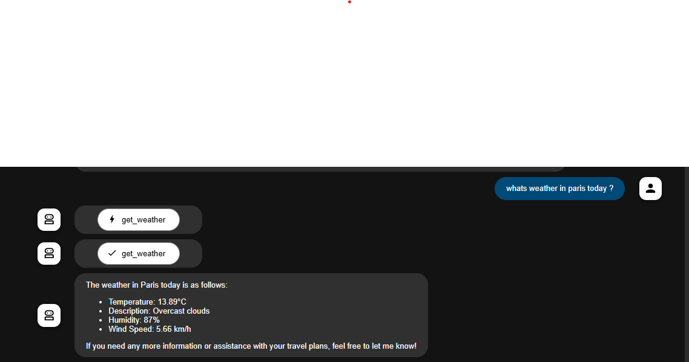
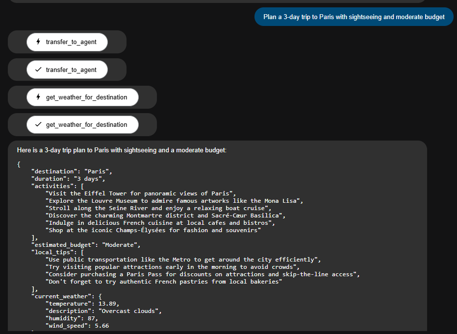
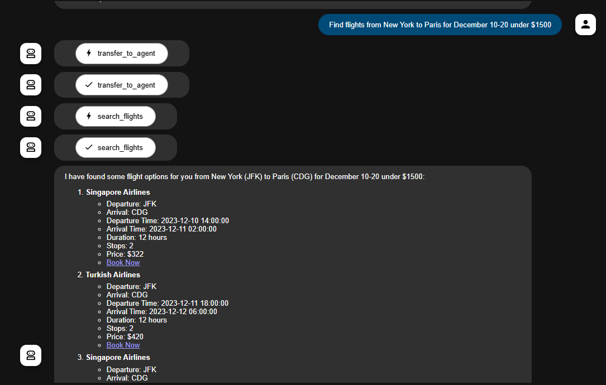

# AI Travel Planner


A multi-agent AI system for planning resort vacations. Includes agents for weather, flights, resort recommendations, activities, and budget evaluation.

## Features

- **Root Agent**: Orchestrates all sub-agents to provide a seamless user experience.
- **Weather Agent**: Checks the weather at the destination to help you pack accordingly.
- **Flight Agent**: Finds the best flights that fit your budget and schedule.
- **Resort Agent**: Recommends the best resorts and hotels based on your preferences.
- **Activity Agent**: Suggests daily activities and attractions to make your trip unforgettable.
- **Budget Agent**: Calculates the total cost of the trip and ensures it stays within your budget.

## Architecture

The project is built using a multi-agent architecture, with a root agent that delegates tasks to specialized sub-agents. The folder structure is as follows:

```
├── agents
│   ├── __init__.py
│   ├── flight_agent.py
│   ├── planner_agents.py
│   └── weather_agent.py
├── tools
│   ├── __init__.py
│   ├── flight_tool.py
│   └── weather_tools.py
├── .env
├── agent.py
├── LICENSE
└── README.md
```

## Installation

1. Clone the repository:
   ```bash
   git clone https://github.com/your-username/cognitive-resort-planner.git
   ```
2. Install the dependencies:
   ```bash
   pip install -r requirements.txt
   ```
3. Set up your environment variables (see below).

## Usage

To start the planner, run the following command:

```bash
python agent.py or adk web 
```

You will then be prompted to enter your vacation details. For example:

```
"Plan a 5-day luxury resort vacation in Paris under $3000. Include flights, hotel, and activities."
```

## Environment Variables

Create a `.env` file in the root directory of the project and add the following environment variables:

```
OPENROUTER_API_KEY="your-openrouter-api-key"
OPENWEATHER_API_KEY="your-openweathermap-api-key"
AVIATIONSTACK_API_KEY="your-aviationstack-api-key"
```

## Contributing

Contributions are welcome! Please open an issue or submit a pull request if you have any suggestions or improvements.

## License

This project is licensed under the MIT License. See the [LICENSE](LICENSE) file for details.

## Screenshots

### Agent Capabilities


### Weather


### Trip Plan


### Flight Options


### User Recognition

